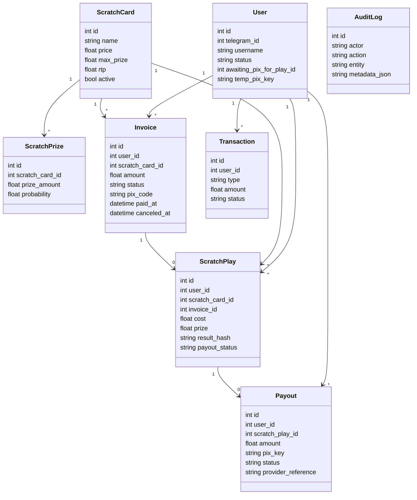

# UML — Raspadinha Telegram com Invoice Demo

```mermaid
classDiagram
    class User {
        int id
        int telegram_id
        string username
        string status
        int awaiting_pix_for_play_id
        string temp_pix_key
    }

    class ScratchCard {
        int id
        string name
        float price
        float max_prize
        float rtp
        bool active
    }

    class ScratchPrize {
        int id
        int scratch_card_id
        float prize_amount
        float probability
    }

    class Invoice {
        int id
        int user_id
        int scratch_card_id
        float amount
        string status
        string pix_code
        datetime paid_at
        datetime canceled_at
    }

    class ScratchPlay {
        int id
        int user_id
        int scratch_card_id
        int invoice_id
        float cost
        float prize
        string result_hash
        string payout_status
    }

    class Payout {
        int id
        int user_id
        int scratch_play_id
        float amount
        string pix_key
        string status
        string provider_reference
    }

    class Transaction {
        int id
        int user_id
        string type
        float amount
        string status
    }

    class AuditLog {
        int id
        string actor
        string action
        string entity
        string metadata_json
    }

    User "1" --> "*" Invoice
    User "1" --> "*" ScratchPlay
    User "1" --> "*" Payout
    User "1" --> "*" Transaction
    ScratchCard "1" --> "*" ScratchPrize
    ScratchCard "1" --> "*" Invoice
    ScratchCard "1" --> "*" ScratchPlay
    Invoice "1" --> "0..1" ScratchPlay
    ScratchPlay "1" --> "0..1" Payout
```
